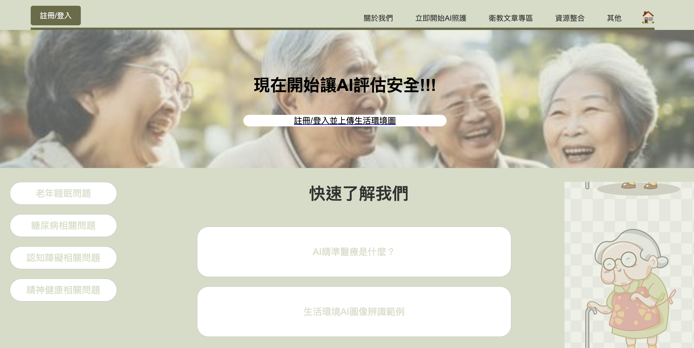

# 精準健康醫療照護網站

網頁的主頁面目前是在/crud

主頁中目前有的功能：
1. [註冊/登入](##註冊與登入)
2. 關於我們
3. 立即開始AI照護 和 註冊/登入並上傳生活照
4. 衛教文章專區
5. Home button

## 註冊/登入
### 註冊
註冊時會讓使用者填寫 電子郵件、使用者名稱、密碼 並選擇身份(現在暫時用Option1.2.3，之後可以改成看護之類的)，註冊後會記錄使用者的所有資料。
### 登入
登入後會記錄使用者的身份和名稱，方便後續資料提供。

## 關於我們
點擊關於我們後會輸出[us.txt](apps/crud/static/text/us.txt)中的文字內容。將確認好的文字內容放到文字檔後可以直接輸出。

當然也可以更改[us.html](apps/crud/templates/crud/us.html)來編輯這個頁面的配置。

## 立即開始AI照護 和 註冊/登入並上傳生活照
