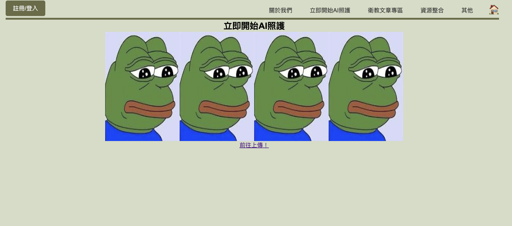
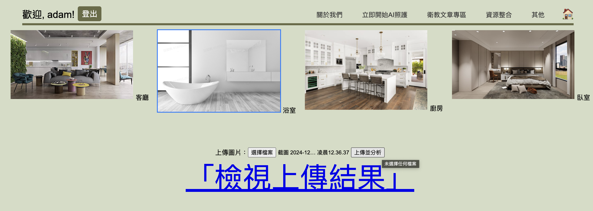
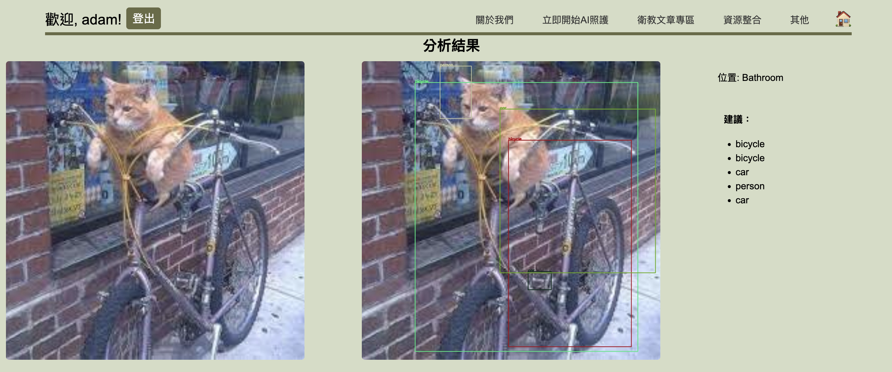
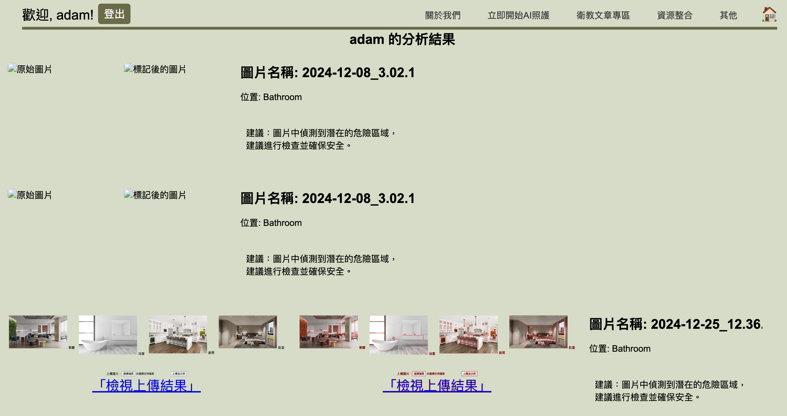

# 精準健康醫療照護網站

網頁的主頁面目前是在/crud

主頁中目前有的功能：
1. [註冊/登入](#註冊登入)
2. [關於我們](#關於我們)
3. [立即開始AI照護 和 註冊/登入並上傳生活照](#立即開始ai照護-和-註冊登入並上傳生活照)
4. 衛教文章專區
5. Home button

## 註冊/登入
### 註冊
註冊時會讓使用者填寫 電子郵件、使用者名稱、密碼 並選擇身份(現在暫時用Option1.2.3，之後可以改成看護之類的)，註冊後會記錄使用者的所有資料。
### 登入
登入後會記錄使用者的身份和名稱，方便後續資料提供。

## 關於我們
點擊關於我們後會輸出[us.txt](apps/crud/static/text/us.txt)中的文字內容。將確認好的文字內容放到文字檔後可以直接輸出。

當然也可以更改[us.html](apps/crud/templates/crud/us.html)來編輯這個頁面的配置。

## 立即開始AI照護 和 註冊/登入並上傳生活照
這兩個按鈕會導到同一個頁面[example.html](apps/crud/templates/crud/example.html)

這裡將會放不同場景的範例下方放置連結(前往上傳！)跳轉到下一個頁面，這個範例圖會再分析完整後製作

這個上傳頁面的配置可以修改[upload.html](apps/crud/templates/crud/upload.html)。上傳時使用者必須上傳指定格式(.jpg,.png,.jpeg)，並選擇對應的場景，上傳後會記錄使用者上傳的圖片、分析後的圖片、給出的建議、選擇的場景，並輸出結果

這個分析的model還需要再被訓練，目前只是用簡單的OpenCV分析，但這個分析模型可以被訓練後重新導入這個網站。使用者每上傳一次圖片，系統會根據當下登入的名稱自動建立一個資料夾在[uploads](uploads)底下，儲存上傳的照片和分析後的照片。另外，每上傳一次照片，數據庫[local.sqlite](local.sqlite)中的*analysis_result*表格也會新增一筆資料，包含 使用者名稱、圖片路徑、分析後圖片路徑、建議、user_id、location(選擇的場景)。在上傳頁面會有一個 檢視上傳結果 按鈕，可以直接叫出該使用者上傳過的所有資料。

