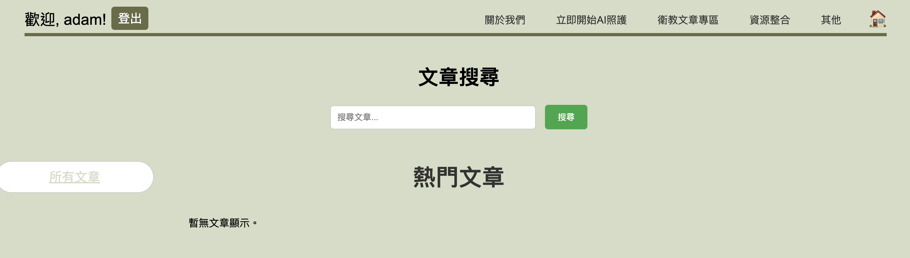

# 精準健康醫療照護網站

網頁的主頁面目前是在/crud的端口上，頁面配置在[nccu.html](apps/crud/templates/crud/nccu.html)。

主頁中目前有的功能：
1. [註冊/登入](#註冊登入)
2. [關於我們](#關於我們)
3. [立即開始AI照護 和 註冊/登入並上傳生活照](#立即開始ai照護-和-註冊登入並上傳生活照)
4. [衛教文章專區](#衛教文章專區)
5. [Home button](#home-button)

## 註冊/登入
### 註冊
註冊時會讓使用者填寫 電子郵件、使用者名稱、密碼 並選擇身份(現在暫時用Option1.2.3，之後可以改成看護之類的)，註冊後會記錄使用者的所有資料，儲存到資料庫[local.sqlite](local.sqlite)中的*users*表格。
### 登入
登入後會記錄使用者的身份和名稱，方便後續資料提供。

## 關於我們
點擊關於我們後會輸出[us.txt](apps/crud/static/text/us.txt)中的文字內容。將確認好的文字內容放到文字檔後可以直接輸出。

當然也可以更改[us.html](apps/crud/templates/crud/us.html)來編輯這個頁面的配置。

## 立即開始AI照護 和 註冊/登入並上傳生活照
這兩個按鈕會導到同一個頁面[example.html](apps/crud/templates/crud/example.html)

這裡將會放不同場景的範例下方放置連結(前往上傳！)跳轉到下一個頁面，這個範例圖會再分析完整後製作

這個上傳頁面的配置可以修改[upload.html](apps/crud/templates/crud/upload.html)。上傳時使用者必須上傳指定格式(.jpg,.png,.jpeg)，並選擇對應的場景，上傳後會記錄使用者上傳的圖片、分析後的圖片、給出的建議、選擇的場景，並輸出結果，結果的顯示配置可以修改[uploadresult.html](apps/crud/templates/crud/uploadresult.html)

這個分析的model還需要再被訓練，目前只是用簡單的OpenCV分析，但這個分析模型可以被訓練後重新導入這個網站。使用者每上傳一次圖片，系統會根據當下登入的名稱自動建立一個資料夾在[uploads](uploads)底下，儲存上傳的照片和分析後的照片。另外，每上傳一次照片，數據庫[local.sqlite](local.sqlite)中的*analysis_result*表格也會新增一筆資料，包含 使用者名稱、圖片路徑、分析後圖片路徑、建議、user_id、location(選擇的場景)。在上傳頁面會有一個 檢視上傳結果 按鈕，可以直接叫出該使用者上傳過的所有資料。

一樣顯示方式可以修改[results.html](apps/crud/templates/crud/results.html)。

## 衛教文章專區
預計在這個頁面中會顯示不同主題的衛教文章，並且顯示點擊次數，配置可修改[articles.html](apps/crud/templates/crud/articles.html)。

現在做到的這個頁面是還沒有任何文章的狀態。
目前的預想是會利用爬蟲程式[crawler.py](scripts/crawler.py)，爬取特定網站的新聞資料，並將這些*raw_articles*存到數據庫[local.sqlite](local.sqlite)中的*raw_articles*表格。之後由管理者進入端口(/crud/admin/raw_articles)[admin_raw_article.html](apps/crud/templates/crud/admin_raw_article.html)來查看所又原始文章，在管理者點擊這些原始文章後會跳轉到端口(/crud/admin/categorize/int:article_id)[categorize_article.html](apps/crud/templates/crud/categorize_article.html)來篩選並分類這些文章，分類的總類會存到數據庫[local.sqlite](local.sqlite)中的*categories*表格。篩選過後的文章會存到數據庫[local.sqlite](local.sqlite)中的*filtered_articles*表格。

最後在這個文章的頁面，左側分類按鈕會根據*categories*表格中的項目自動生成。顯示的文章會是*filtered_articles*表格中的文章。

## Home button
點擊房子圖示，可以回到首頁[nccu.html](apps/crud/templates/crud/nccu.html)。

